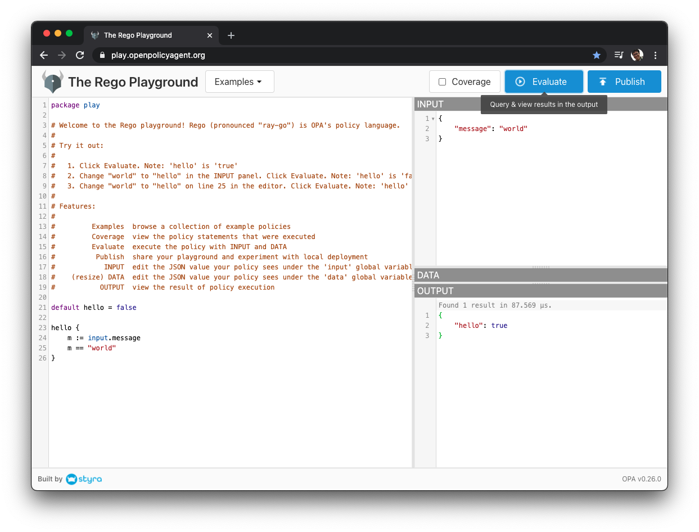
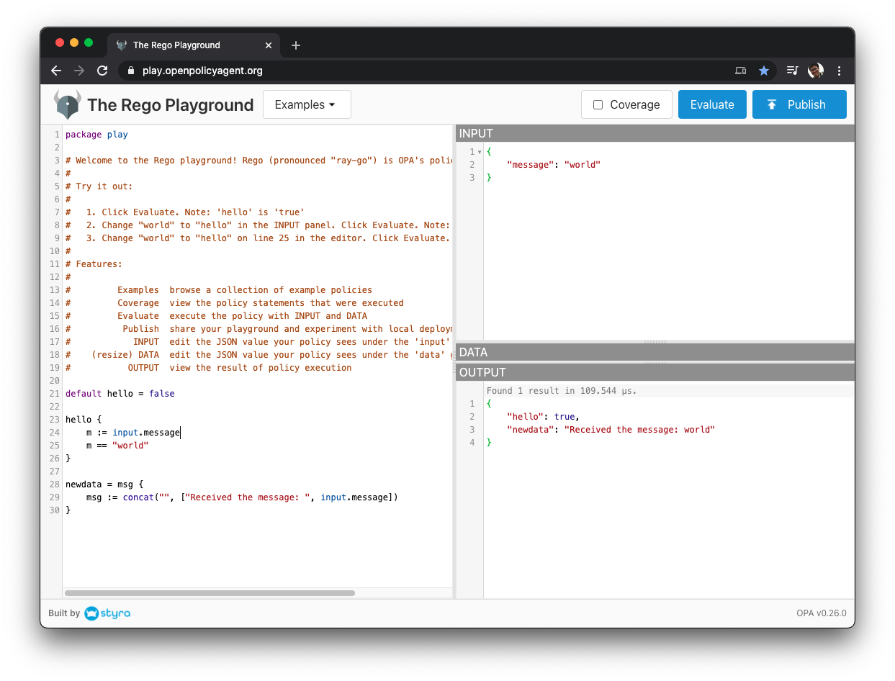

# Open Policy Agent (OPA) 事始め

Copyright: Hiro Osaki 2021


はじめに

このドキュメントは、[Open Policy Agent (OPA)](https://www.openpolicyagent.org/) を一度触ってみたいという方向けです. 

最短経路は8分で済みます.

##  1. 初めてのRego: Rego Playground

OPAとそこで使われるRego言語がどんなものなのかを掴むのに, OPAをインストールす必要はありません. 最速の方法は, [Styra](styra.com)が開発した["Rego Playground"](https://play.openpolicyagent.org/) というWebサービスを使うことです.

###  1.1. Rego言語のプログラムを動かしてみる (所要: 5分)

- https://play.openpolicyagent.org/ にアクセス.
- `Evaluate` ボタンをクリック.

  

- 初の **Rego 言語** プログラミングにチャレンジしましょう. 左のウィンドウの一番下に, 以下の3行を足します.

  ```
  newdata = msg {
    msg := concat("", ["Received the message: ", input.message])
  }
  ```

  この3行は、新しいデータ `newdata` を追加するコードです.

- 再度 `Evaluate` をクリック.
  
  `OUTPUT` ウィンドウに新しいデータ `newdata` が追加されます.

  

  その結果はこのようになります.
  ```
  {
    "hello": true,
    "newdata": "Received the message: world"
  }
  ```

  2行目の `"newdata": ...` が、新しいデータです. それ以外の `"hello"` は, もともとのソースコード `hello {...}` の結果です.